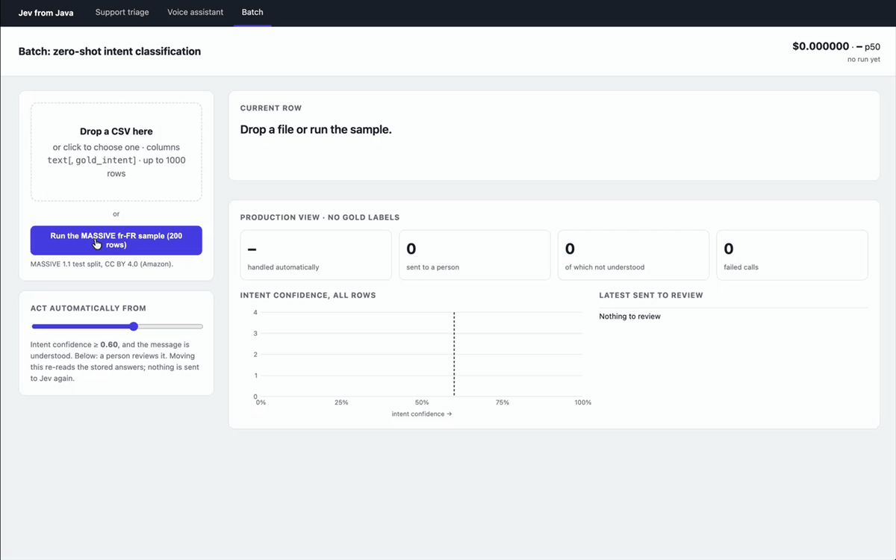
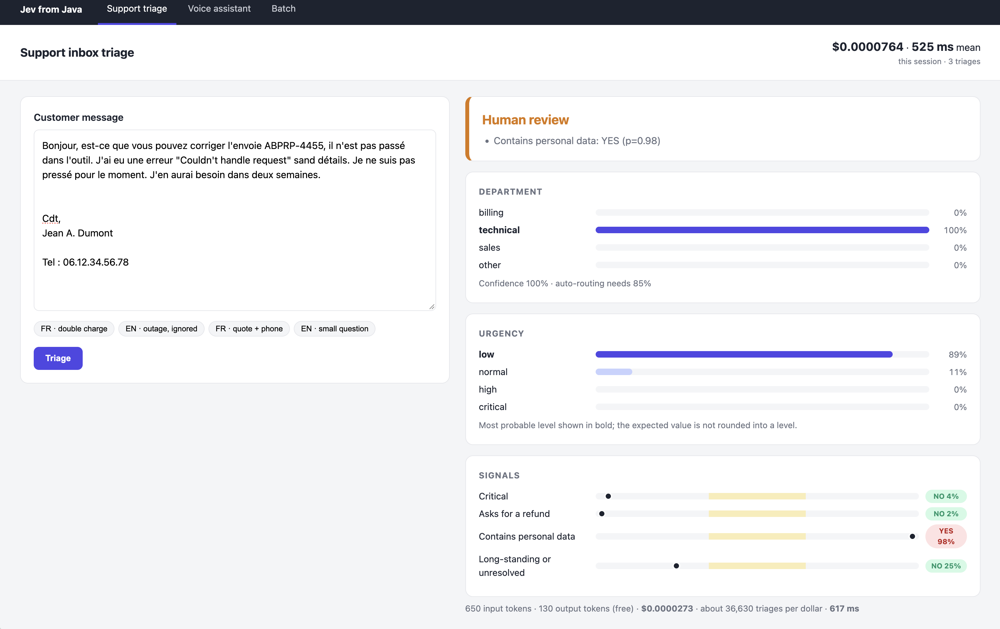

# Jev from Java

A small web app that calls [Jev](https://docs.typesafe.ai) (TypeSafe's typed decision model) from Java.
There is no Java SDK, so the API contract is typed by hand with records and sealed types. Small wrappers such as `ApiKey`, `ModelId` and `Probability` are the kind of type that becomes a [Valhalla value class](https://openjdk.org/jeps/401) once JEP 401 ships.



Three tabs:

- **Support triage**: a customer message in French or English gets a department, an urgency and risk signals,
  and is routed automatically or to a person depending on confidence.
- **Voice assistant**: 60 MASSIVE intents plus `unsupported`, with typed commands (alarm, weather, lights,
  calendar), in single or multi-action mode.
- **Batch**: drop a CSV, or run the bundled MASSIVE fr-FR sample, and watch each row get classified live.



## Run

Requires JDK 25 or newer, Maven, and a TypeSafe API key.

```sh
export TYPESAFE_API_KEY=...

mvn -q package -DskipTests dependency:build-classpath -Dmdep.outputFile=cp.txt
java -cp "target/classes:$(cat cp.txt)" Main
```

Open http://localhost:7070. Tests: `mvn test`; add `JEV_LIVE_TESTS=true` to also run the ones that call the real API.

## License

Code: MIT. The sample in `src/main/resources/samples/` comes from
[MASSIVE](https://github.com/alexa/massive) (Amazon) and is under CC BY 4.0, see its
[NOTICE](src/main/resources/samples/NOTICE.md).
